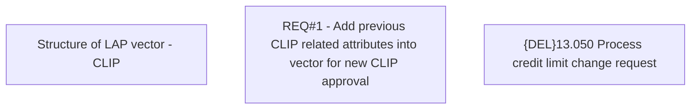

# CBL-3051 (CLM-1388) Adding CLIP related attributes into vector

```mermaid
graph TD
    Structure_of_LAP_vector_CLIP["Structure of LAP vector - CLIP"]
    REQ_1_Add_previous_CLIP_related_attributes_into_vector_for_n["REQ#1 - Add previous CLIP related attributes into vector for new CLIP approval "]
    DEL_13_050_Process_credit_limit_change_request["{DEL}13.050 Process credit limit change request"]
```
