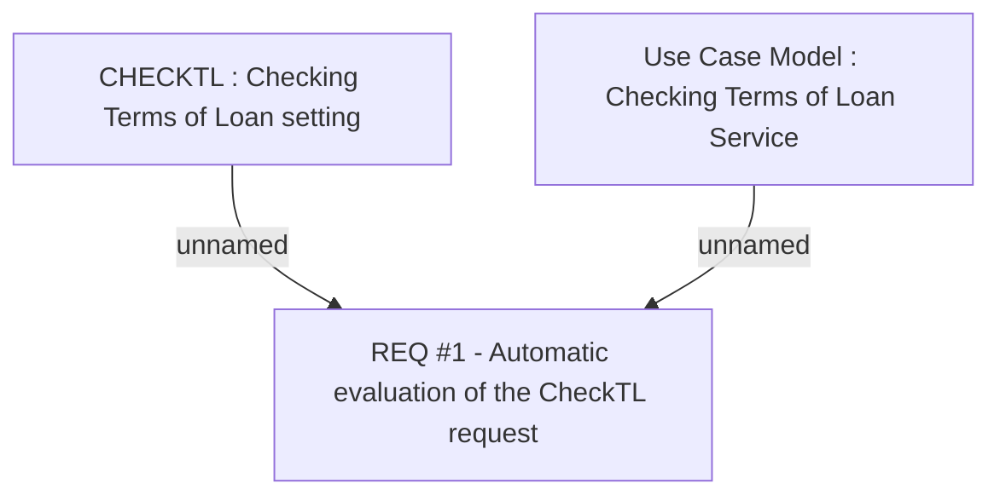

# CBL-3070 (CLM-1787) Automatic evaluation of CheckTL service

```mermaid
graph TD
    CHECKTL_Checking_Terms_of_Loan_setting["CHECKTL : Checking Terms of Loan setting"]
    Use_Case_Model_Checking_Terms_of_Loan_Service["Use Case Model : Checking Terms of Loan Service"]
    REQ_1_Automatic_evaluation_of_the_CheckTL_request["REQ #1 - Automatic evaluation of the CheckTL request"]
    CHECKTL_Checking_Terms_of_Loan_setting -->|unnamed| REQ_1_Automatic_evaluation_of_the_CheckTL_request
    Use_Case_Model_Checking_Terms_of_Loan_Service -->|unnamed| REQ_1_Automatic_evaluation_of_the_CheckTL_request
```
