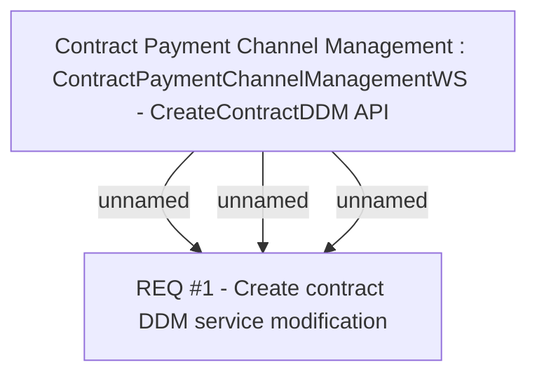

# CBL-3093 (CLM-1475) Modification of Contract Direct Debit Service for SI info

```mermaid
graph TD
    REQ_1_Create_contract_DDM_service_modification["REQ #1 - Create contract DDM service modification"]
    Contract_Payment_Channel_Management_ContractPaymentChannelMa["Contract Payment Channel Management : ContractPaymentChannelManagementWS - UpdateContractDDM"]
    Contract_Payment_Channel_Management_ContractPaymentChannelMa["Contract Payment Channel Management : ContractPaymentChannelManagementWS - GetContractDDMList"]
    Contract_Payment_Channel_Management_ContractPaymentChannelMa["Contract Payment Channel Management : ContractPaymentChannelManagementWS - CreateContractDDM API"]
    Contract_Payment_Channel_Management_ContractPaymentChannelMa -->|unnamed| REQ_1_Create_contract_DDM_service_modification
    Contract_Payment_Channel_Management_ContractPaymentChannelMa -->|unnamed| REQ_1_Create_contract_DDM_service_modification
    Contract_Payment_Channel_Management_ContractPaymentChannelMa -->|unnamed| REQ_1_Create_contract_DDM_service_modification
```
