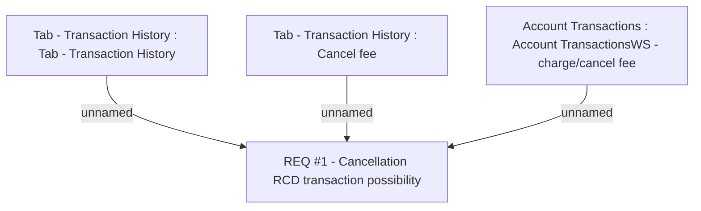

# CBL-3240 (CLM-1329) Additional Change of Loan on Phone

```mermaid
graph TD
    REQ_1_Cancellation_RCD_transaction_possibility["REQ #1 - Cancellation RCD transaction possibility"]
    Tab_Transaction_History_Tab_Transaction_History["Tab - Transaction History : Tab - Transaction History"]
    Tab_Transaction_History_Cancel_fee["Tab - Transaction History : Cancel fee"]
    Account_Transactions_Account_TransactionsWS_charge_cancel_fe["Account Transactions : Account TransactionsWS - charge/cancel fee"]
    Tab_Transaction_History_Tab_Transaction_History -->|unnamed| REQ_1_Cancellation_RCD_transaction_possibility
    Tab_Transaction_History_Cancel_fee -->|unnamed| REQ_1_Cancellation_RCD_transaction_possibility
    Account_Transactions_Account_TransactionsWS_charge_cancel_fe -->|unnamed| REQ_1_Cancellation_RCD_transaction_possibility
```
