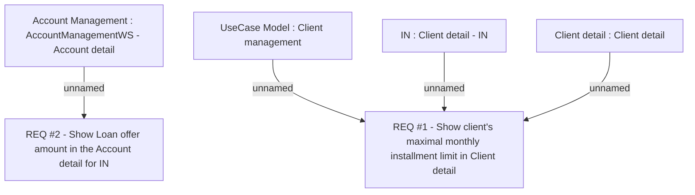

# CBL-3261 (CLM-1298) Available EMI Card offer displayed in Client detail

```mermaid
graph TD
    REQ_2_Show_Loan_offer_amount_in_the_Account_detail_for_IN["REQ #2 - Show Loan offer amount in the Account detail for IN"]
    Account_Management_AccountManagementWS_Account_detail["Account Management : AccountManagementWS - Account detail"]
    UseCase_Model_Client_management["UseCase Model : Client management"]
    IN_Client_detail_IN["IN : Client detail - IN"]
    Client_detail_Client_detail["Client detail : Client detail"]
    REQ_1_Show_client_s_maximal_monthly_installment_limit_in_Cli["REQ #1 - Show client's maximal monthly installment limit in Client detail"]
    UseCase_Model_Client_management -->|unnamed| REQ_1_Show_client_s_maximal_monthly_installment_limit_in_Cli
    IN_Client_detail_IN -->|unnamed| REQ_1_Show_client_s_maximal_monthly_installment_limit_in_Cli
    Client_detail_Client_detail -->|unnamed| REQ_1_Show_client_s_maximal_monthly_installment_limit_in_Cli
    Account_Management_AccountManagementWS_Account_detail -->|unnamed| REQ_2_Show_Loan_offer_amount_in_the_Account_detail_for_IN
```
