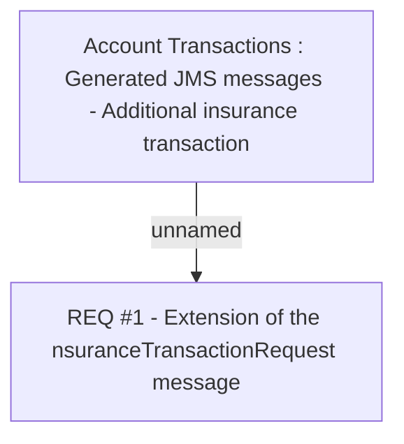

# CBL-3320 (CLM-1337) Add initial transaction type to InsuranceTransactionRequest JMS

- **Diagram Type**: Custom
- **Package**: HomerSelect/BSL/Requirements Model/Finished/CLM/CBL-3320 (CLM-1337) Add initial transaction type to InsuranceTransactionRequest JMS
- **Diagram ID**: 102566
- **Elements**: 2
- **Connectors**: 1

