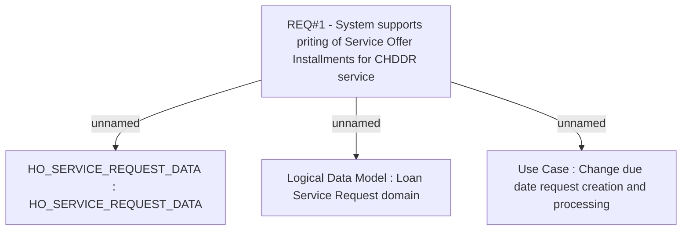

# CBL-3378 (CLM-1315) Printing preliminary IS for CHDDR service request

```mermaid
graph TD
    Use_Case_Change_due_date_request_creation_and_processing["Use Case : Change due date request creation and processing"]
    Logical_Data_Model_Loan_Service_Request_domain["Logical Data Model : Loan Service Request domain"]
    HO_SERVICE_REQUEST_DATA_HO_SERVICE_REQUEST_DATA["HO_SERVICE_REQUEST_DATA : HO_SERVICE_REQUEST_DATA"]
    REQ_1_System_supports_priting_of_Service_Offer_Installments_["REQ#1 - System supports priting of Service Offer Installments for CHDDR service"]
    REQ_1_System_supports_priting_of_Service_Offer_Installments_ -->|unnamed| HO_SERVICE_REQUEST_DATA_HO_SERVICE_REQUEST_DATA
    REQ_1_System_supports_priting_of_Service_Offer_Installments_ -->|unnamed| Logical_Data_Model_Loan_Service_Request_domain
    REQ_1_System_supports_priting_of_Service_Offer_Installments_ -->|unnamed| Use_Case_Change_due_date_request_creation_and_processing
```
