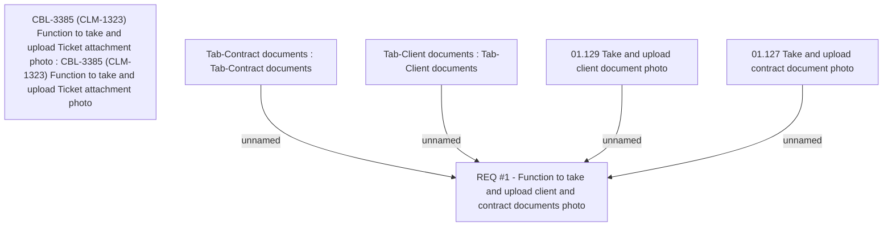

# CBL-3385 Add Photo component into Contract, Client Documents Tab and Ticketing Module

- **Diagram Type**: Custom
- **Package**: HomerSelect/BSL/Requirements Model/Finished/CLM/CBL-3385 (CLM-1323) Add Photo component into Contract, Client Documents Tab and Ticketing Module
- **Diagram ID**: 109364
- **Elements**: 6
- **Connectors**: 4

