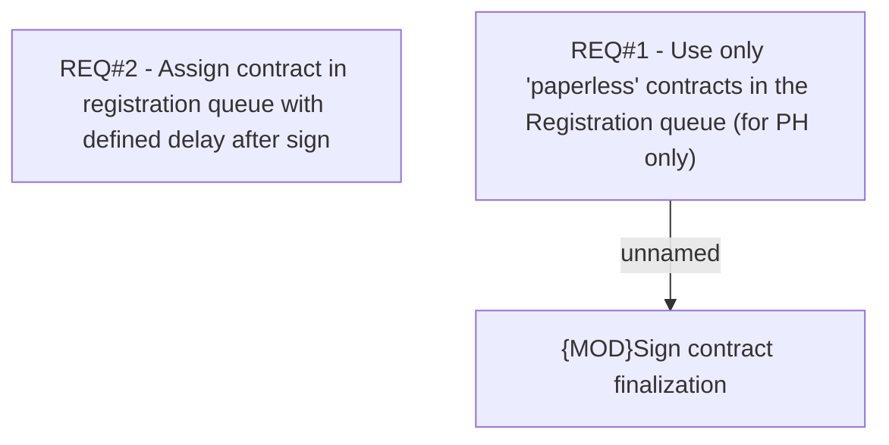

# CBL-3421 (CLM-1328) Paperless Contracts in Registration Queue

- **Diagram Type**: Custom
- **Package**: HomerSelect/BSL/Requirements Model/Finished/CLM/CBL-3421 (CLM-1328) Paperless Contracts in Registration Queue
- **Diagram ID**: 102878
- **Elements**: 3
- **Connectors**: 1

