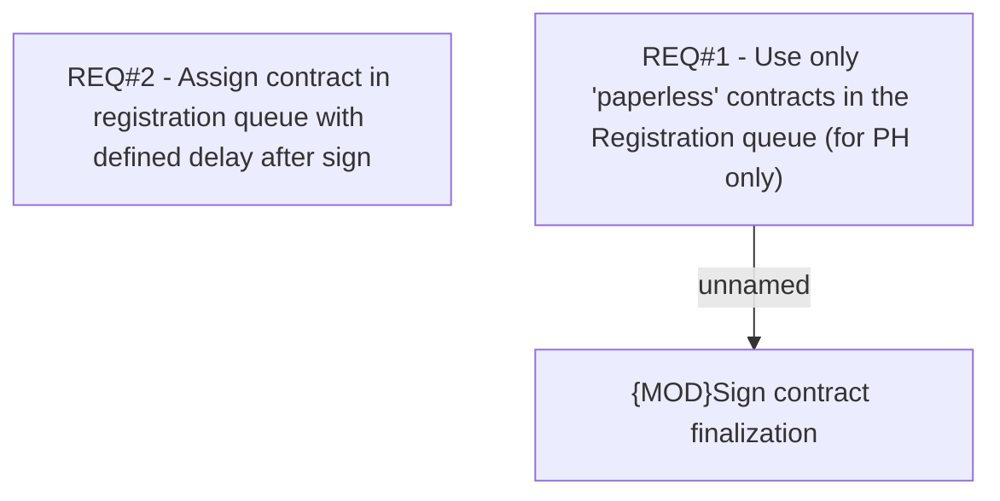

# CBL-3421 (CLM-1328) Paperless Contracts in Registration Queue

```mermaid
graph TD
    REQ_2_Assign_contract_in_registration_queue_with_defined_del["REQ#2 - Assign contract in registration queue with defined delay after sign"]
    REQ_1_Use_only_paperless_contracts_in_the_Registration_queue["REQ#1 - Use only 'paperless' contracts in the Registration queue (for PH only)"]
    MOD_Sign_contract_finalization["{MOD}Sign contract finalization"]
    REQ_1_Use_only_paperless_contracts_in_the_Registration_queue -->|unnamed| MOD_Sign_contract_finalization
```
