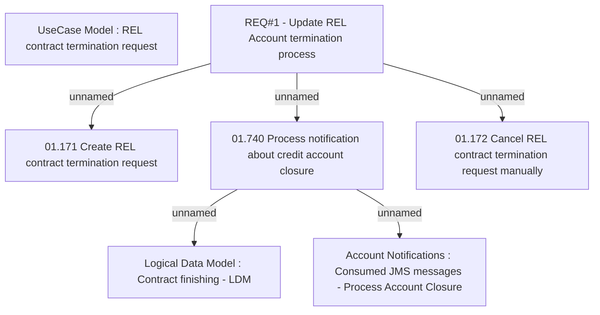

# CBL-3456 (CLM-1436) Account Termination without waiting EOM process

```mermaid
graph TD
    Logical_Data_Model_Contract_finishing_LDM["Logical Data Model : Contract finishing - LDM"]
    Account_Notifications_Consumed_JMS_messages_Process_Account_["Account Notifications : Consumed JMS messages - Process Account Closure"]
    n_01_171_Create_REL_contract_termination_request["01.171 Create REL contract termination request"]
    n_01_740_Process_notification_about_credit_account_closure["01.740 Process notification about credit account closure "]
    n_01_172_Cancel_REL_contract_termination_request_manually["01.172 Cancel REL contract termination request manually"]
    UseCase_Model_REL_contract_termination_request["UseCase Model : REL contract termination request"]
    REQ_1_Update_REL_Account_termination_process["REQ#1 - Update REL Account termination process"]
    REQ_1_Update_REL_Account_termination_process -->|unnamed| n_01_171_Create_REL_contract_termination_request
    REQ_1_Update_REL_Account_termination_process -->|unnamed| n_01_740_Process_notification_about_credit_account_closure
    REQ_1_Update_REL_Account_termination_process -->|unnamed| n_01_172_Cancel_REL_contract_termination_request_manually
    n_01_740_Process_notification_about_credit_account_closure -->|unnamed| Logical_Data_Model_Contract_finishing_LDM
    n_01_740_Process_notification_about_credit_account_closure -->|unnamed| Account_Notifications_Consumed_JMS_messages_Process_Account_
```
