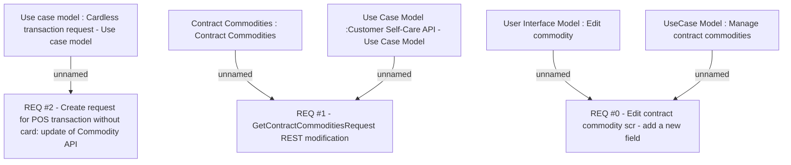

# CBL-3558 (CLM-1480) New commodity attribute Sim Card

```mermaid
graph TD
    Use_case_model_Cardless_transaction_request_Use_case_model["Use case model : Cardless transaction request - Use case model"]
    Use_Case_Model_Customer_Self_Care_API_Use_Case_Model["Use Case Model :Customer Self-Care API - Use Case Model"]
    Contract_Commodities_Contract_Commodities["Contract Commodities : Contract Commodities"]
    UseCase_Model_Manage_contract_commodities["UseCase Model : Manage contract commodities"]
    User_Interface_Model_Edit_commodity["User Interface Model : Edit commodity"]
    REQ_2_Create_request_for_POS_transaction_without_card_update["REQ #2 - Create request for POS transaction without card: update of Commodity API"]
    REQ_1_GetContractCommoditiesRequest_REST_modification["REQ #1 - GetContractCommoditiesRequest REST modification"]
    REQ_0_Edit_contract_commodity_scr_add_a_new_field["REQ #0 - Edit contract commodity scr - add a new field"]
    Use_case_model_Cardless_transaction_request_Use_case_model -->|unnamed| REQ_2_Create_request_for_POS_transaction_without_card_update
    Contract_Commodities_Contract_Commodities -->|unnamed| REQ_1_GetContractCommoditiesRequest_REST_modification
    Use_Case_Model_Customer_Self_Care_API_Use_Case_Model -->|unnamed| REQ_1_GetContractCommoditiesRequest_REST_modification
    User_Interface_Model_Edit_commodity -->|unnamed| REQ_0_Edit_contract_commodity_scr_add_a_new_field
    UseCase_Model_Manage_contract_commodities -->|unnamed| REQ_0_Edit_contract_commodity_scr_add_a_new_field
```
