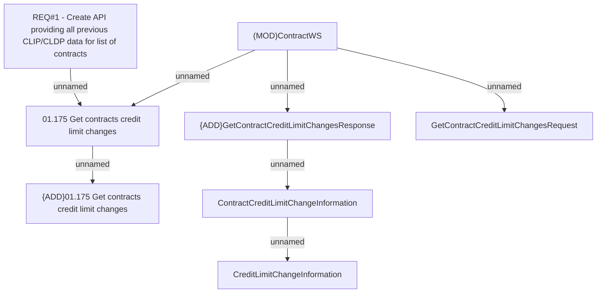

# CBL-3579 (CLM-1390) Previous CLIP/CLDP data for new contracts approval vector

```mermaid
graph TD
    MOD_ContractWS["(MOD)ContractWS"]
    ADD_01_175_Get_contracts_credit_limit_changes["{ADD}01.175 Get contracts credit limit changes"]
    n_01_175_Get_contracts_credit_limit_changes["01.175 Get contracts credit limit changes"]
    CreditLimitChangeInformation["CreditLimitChangeInformation"]
    ContractCreditLimitChangeInformation["ContractCreditLimitChangeInformation"]
    ADD_GetContractCreditLimitChangesResponse["{ADD}GetContractCreditLimitChangesResponse"]
    GetContractCreditLimitChangesRequest["GetContractCreditLimitChangesRequest"]
    REQ_1_Create_API_providing_all_previous_CLIP_CLDP_data_for_l["REQ#1 - Create API providing all previous CLIP/CLDP data for list of contracts"]
    REQ_1_Create_API_providing_all_previous_CLIP_CLDP_data_for_l -->|unnamed| n_01_175_Get_contracts_credit_limit_changes
    n_01_175_Get_contracts_credit_limit_changes -->|unnamed| ADD_01_175_Get_contracts_credit_limit_changes
    ContractCreditLimitChangeInformation -->|unnamed| CreditLimitChangeInformation
    MOD_ContractWS -->|unnamed| GetContractCreditLimitChangesRequest
    MOD_ContractWS -->|unnamed| n_01_175_Get_contracts_credit_limit_changes
    MOD_ContractWS -->|unnamed| ADD_GetContractCreditLimitChangesResponse
    ADD_GetContractCreditLimitChangesResponse -->|unnamed| ContractCreditLimitChangeInformation
```
