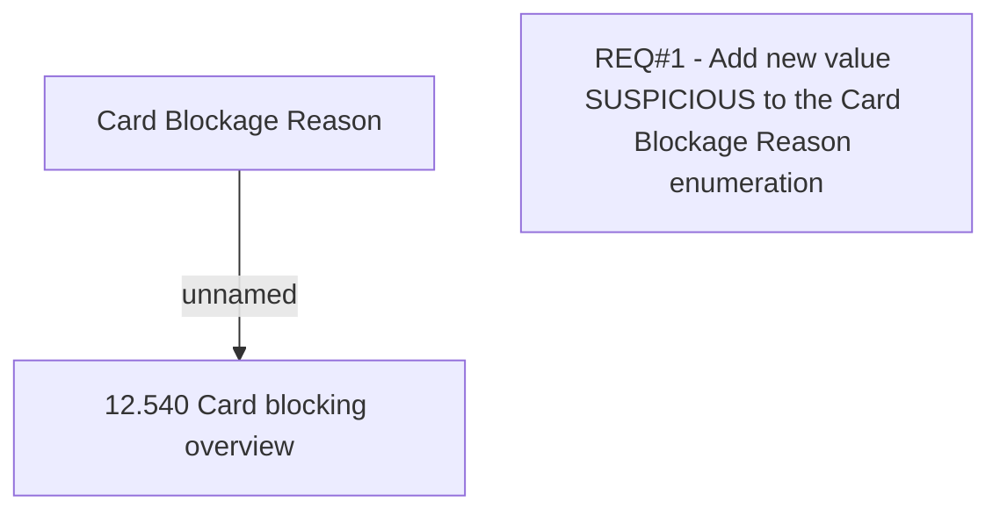

# CBL-3628 (CLM-1433) Add block type SUSPICIOUS

- **Diagram Type**: Custom
- **Package**: HomerSelect/BSL/Requirements Model/Finished/CLM/CBL-3628 (CLM-1433) Add block type SUSPICIOUS
- **Diagram ID**: 104292
- **Elements**: 3
- **Connectors**: 1

