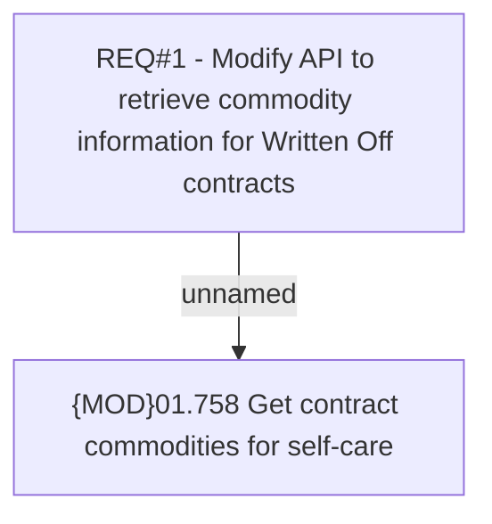

# CBL-3649 (CLM-1438) Enable Get Commodity for Written Off Contracts via Self-Care API

- **Diagram Type**: Custom
- **Package**: HomerSelect/BSL/Requirements Model/Finished/CLM/CBL-3649 (CLM-1438) Enable Get Commodity for Written Off Contracts via Self-Care API
- **Diagram ID**: 104993
- **Elements**: 2
- **Connectors**: 1

