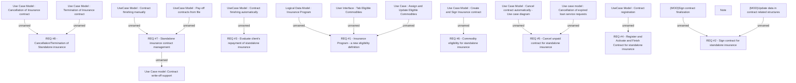

# CBL-3666 (CLM-1478) Extended Warranty Standalone

```mermaid
graph TD
    Use_Case_Model_Termination_of_Insurance_contract["Use Case Model : Termination of Insurance contract "]
    Use_Case_Model_Cancellation_of_Insurance_contract["Use Case Model : Cancellation of Insurance contract"]
    REQ_8_Cancellation_Termination_of_Standalone_insurance["REQ #8 - Cancellation/Termination of Standalone insurance"]
    Use_case_model_Cancellation_of_expired_loan_service_requests["Use case model : Cancellation of expired loan service requests"]
    UseCase_Model_Pay_off_contracts_from_file["UseCase Model : Pay-off contracts from file"]
    UseCase_Model_Contract_finishing_manually["UseCase Model : Contract finishing manually"]
    Use_Case_model_Contract_write_off_support["Use Case model :Contract write-off support"]
    REQ_7_Standalone_insurance_contract_management["REQ #7 - Standalone insurance contract management"]
    Use_Case_Model_Create_and_Sign_Insurance_contract["Use Case Model : Create and Sign Insurance contract"]
    UseCase_Model_Contract_finishing_automatically["UseCase Model : Contract finishing automatically"]
    Use_Case_Model_Cancel_contract_automatically_Use_case_diagra["Use Case Model : Cancel contract automatically - Use case diagram"]
    REQ_3_Evaluate_client_s_repayment_of_standalone_insurance["REQ #3 - Evaluate client's repayment of standalone insurance"]
    Use_Case_Assign_Update_Eligible_Commodities["Use Case : Assign and Update Eligible Commodities"]
    User_Interface_Tab_Eligible_Commodities["User Interface : Tab Eligible Commodities"]
    Logical_Data_Model_Insurance_Program["Logical Data Model : Insurance Program"]
    REQ_1_Insurance_Program_a_new_eligibility_definition["REQ #1 - Insurance Program - a new eligibility definition"]
    UseCase_Model_Contract_registration["UseCase Model : Contract registration"]
    MOD_Update_data_in_contract_related_structures["{MOD}Update data in contract related structures"]
    el_1314953["Note"]
    REQ_6_Commodity_eligibility_for_standalone_insurance["REQ #6 - Commodity eligibility for standalone insurance"]
    REQ_5_Cancel_unpaid_contract_for_standalone_insurance["REQ #5 - Cancel unpaid contract for standalone insurance"]
    REQ_4_Register_Activate_Finish_Contract_for_standalone_insur["REQ #4 - Register and Activate and Finish Contract for standalone insurance"]
    MOD_Sign_contract_finalization["{MOD}Sign contract finalization"]
    REQ_2_Sign_contract_for_standalone_insurance["REQ #2 - Sign contract for standalone insurance"]
    UseCase_Model_Contract_registration -->|unnamed| REQ_4_Register_Activate_Finish_Contract_for_standalone_insur
    Logical_Data_Model_Insurance_Program -->|unnamed| REQ_1_Insurance_Program_a_new_eligibility_definition
    User_Interface_Tab_Eligible_Commodities -->|unnamed| REQ_1_Insurance_Program_a_new_eligibility_definition
    Use_Case_Assign_Update_Eligible_Commodities -->|unnamed| REQ_1_Insurance_Program_a_new_eligibility_definition
    Use_Case_Model_Cancel_contract_automatically_Use_case_diagra -->|unnamed| REQ_5_Cancel_unpaid_contract_for_standalone_insurance
    UseCase_Model_Contract_finishing_automatically -->|unnamed| REQ_3_Evaluate_client_s_repayment_of_standalone_insurance
    Use_Case_Model_Create_and_Sign_Insurance_contract -->|unnamed| REQ_6_Commodity_eligibility_for_standalone_insurance
    REQ_7_Standalone_insurance_contract_management -->|unnamed| Use_Case_model_Contract_write_off_support
    UseCase_Model_Contract_finishing_manually -->|unnamed| REQ_7_Standalone_insurance_contract_management
    UseCase_Model_Pay_off_contracts_from_file -->|unnamed| REQ_7_Standalone_insurance_contract_management
    Use_case_model_Cancellation_of_expired_loan_service_requests -->|unnamed| REQ_5_Cancel_unpaid_contract_for_standalone_insurance
    Use_Case_Model_Cancellation_of_Insurance_contract -->|unnamed| REQ_8_Cancellation_Termination_of_Standalone_insurance
    Use_Case_Model_Termination_of_Insurance_contract -->|unnamed| REQ_8_Cancellation_Termination_of_Standalone_insurance
    MOD_Sign_contract_finalization -->|unnamed| REQ_2_Sign_contract_for_standalone_insurance
    MOD_Update_data_in_contract_related_structures -->|unnamed| REQ_2_Sign_contract_for_standalone_insurance
```
