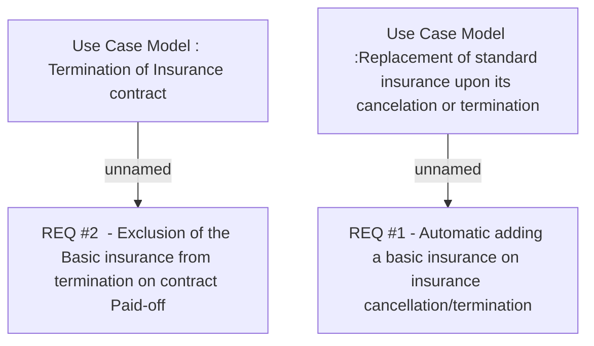

# CBL-3735 (CLM-1581) Mandatory Life Insurance support

- **Diagram Type**: Custom
- **Package**: HomerSelect/BSL/Requirements Model/Finished/CLM/CBL-3735 (CLM-1581) Mandatory Life Insurance support
- **Diagram ID**: 110238
- **Elements**: 4
- **Connectors**: 2

