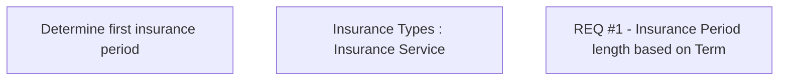

# CBL-3736 (CLM-1489) Additional Protection Validity Period

```mermaid
graph TD
    Determine_first_insurance_period["Determine first insurance period"]
    Insurance_Types_Insurance_Service["Insurance Types : Insurance Service"]
    REQ_1_Insurance_Period_length_based_on_Term["REQ #1 - Insurance Period length based on Term"]
```
