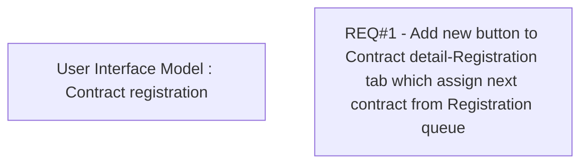

# CBL-3762 (CLM-1452) Assign next contract in Registration Tab

- **Diagram Type**: Custom
- **Package**: HomerSelect/BSL/Requirements Model/Finished/CLM/CBL-3762 (CLM-1452) Assign next contract in Registration Tab
- **Diagram ID**: 105885
- **Elements**: 2
- **Connectors**: 0

