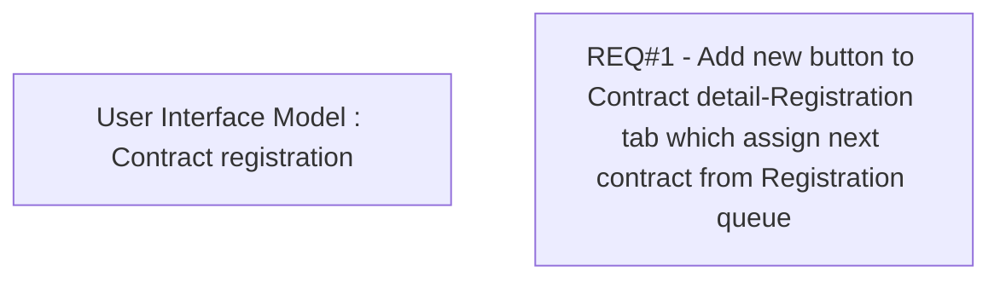

# CBL-3762 (CLM-1452) Assign next contract in Registration Tab

```mermaid
graph TD
    User_Interface_Model_Contract_registration["User Interface Model : Contract registration"]
    REQ_1_Add_new_button_to_Contract_detail_Registration_tab_whi["REQ#1 - Add new button to Contract detail-Registration tab which assign next contract from Registration queue"]
```
