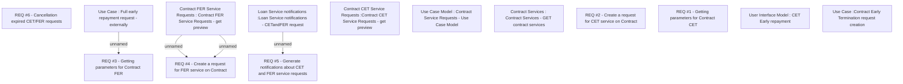

# CBL-3825 (CLM-1460) Create CET/FER request in Mobile banking system

```mermaid
graph TD
    REQ_6_Cancellation_expired_CET_FER_requests["REQ #6 - Cancellation expired CET/FER requests"]
    Use_Case_Full_early_repayment_request_externally["Use Case : Full early repayment request - externally"]
    Contract_FER_Service_Requests_Contract_FER_Service_Requests_["Contract FER Service Requests : Contract FER Service Requests - create request"]
    Contract_FER_Service_Requests_Contract_FER_Service_Requests_["Contract FER Service Requests : Contract FER Service Requests - get preview"]
    Loan_Service_notifications_Loan_Service_notifications_CET_FE["Loan Service notifications :Loan Service notifications - CETandFER request"]
    REQ_4_Create_a_request_for_FER_service_on_Contract["REQ #4 - Create a request for FER service on Contract"]
    REQ_3_Getting_parameters_for_Contract_FER["REQ #3 - Getting parameters for Contract FER "]
    REQ_5_Generate_notifications_about_CET_FER_service_requests["REQ #5 - Generate notifications about CET and FER service requests"]
    Contract_CET_Service_Requests_Contract_CET_Service_Requests_["Contract CET Service Requests :Contract CET Service Requests - get preview"]
    Use_Case_Model_Contract_Service_Requests_Use_Case_Model["Use Case Model : Contract Service Requests - Use Case Model"]
    Contract_Services_Contract_Services_GET_contract_services["Contract Services : Contract Services - GET contract services"]
    REQ_2_Create_a_request_for_CET_service_on_Contract["REQ #2 - Create a request for CET service on Contract"]
    REQ_1_Getting_parameters_for_Contract_CET["REQ #1 - Getting parameters for Contract CET"]
    User_Interface_Model_CET_Early_repayment["User Interface Model : CET Early repayment"]
    Use_Case_Contract_Early_Termination_request_creation["Use Case :Contract Early Termination request creation"]
    Loan_Service_notifications_Loan_Service_notifications_CET_FE -->|unnamed| REQ_5_Generate_notifications_about_CET_FER_service_requests
    Use_Case_Full_early_repayment_request_externally -->|unnamed| REQ_3_Getting_parameters_for_Contract_FER
    Contract_FER_Service_Requests_Contract_FER_Service_Requests_ -->|unnamed| REQ_4_Create_a_request_for_FER_service_on_Contract
    Contract_FER_Service_Requests_Contract_FER_Service_Requests_ -->|unnamed| REQ_4_Create_a_request_for_FER_service_on_Contract
```
