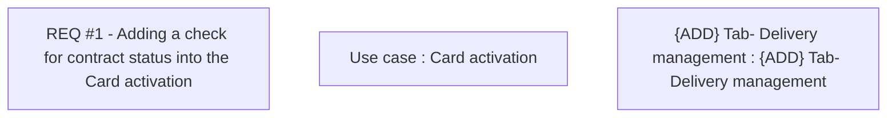

# CBL-3838 (CLM-1477) Debit cards via RSA channel

```mermaid
graph TD
    REQ_1_Adding_a_check_for_contract_status_into_the_Card_activ["REQ #1 - Adding a check for contract status into the Card activation"]
    Use_case_Card_activation["Use case : Card activation"]
    ADD_Tab_Delivery_management_ADD_Tab_Delivery_management["{ADD} Tab- Delivery management : {ADD} Tab- Delivery management"]
```
