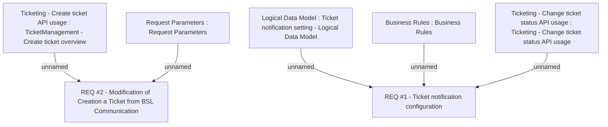

# CBL-3916 (CLM-1492) TCK - messaging support for specific tickets

- **Diagram Type**: Custom
- **Package**: HomerSelect/BSL/Requirements Model/Finished/CLM/CBL-3916 (CLM-1492) TCK - messaging support for specific tickets
- **Diagram ID**: 119118
- **Elements**: 7
- **Connectors**: 5

