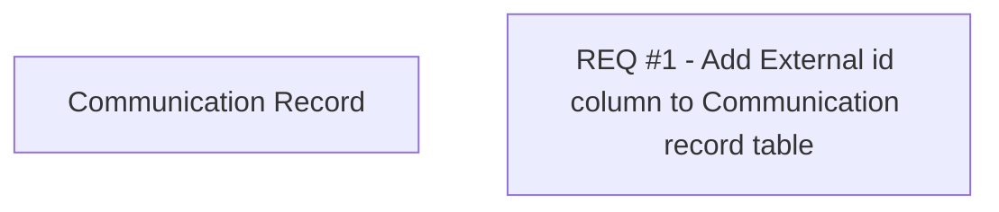

# CBL-3917 (CLM-1508) BSL Communication - REQ #1

- **Diagram Type**: Custom
- **Package**: HomerSelect/BSL/Requirements Model/Finished/CLM/CBL-3917 (CLM-1508) BSL Communication - support for notification about specific comm records
- **Diagram ID**: 140304
- **Elements**: 2
- **Connectors**: 0

