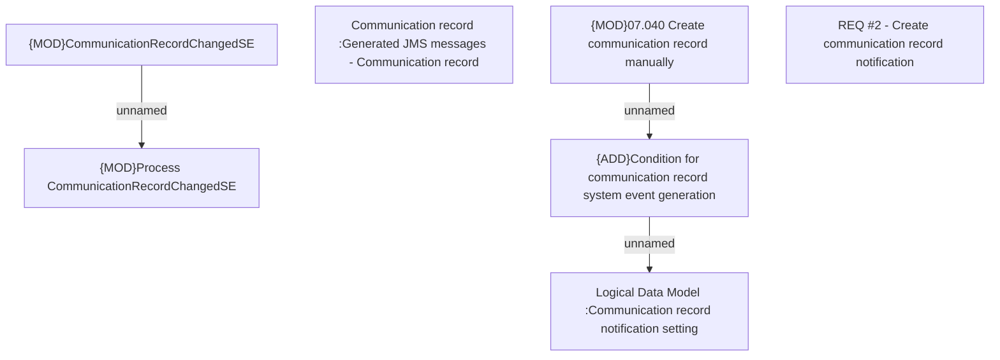

# CBL-3917 (CLM-1508) BSL Communication - REQ #2

```mermaid
graph TD
    MOD_CommunicationRecordChangedSE["{MOD}CommunicationRecordChangedSE"]
    Communication_record_Generated_JMS_messages_Communication_re["Communication record :Generated JMS messages - Communication record"]
    MOD_Process_CommunicationRecordChangedSE["{MOD}Process CommunicationRecordChangedSE"]
    Logical_Data_Model_Communication_record_notification_setting["Logical Data Model :Communication record notification setting"]
    ADD_Condition_for_communication_record_system_event_generati["{ADD}Condition for communication record system event generation"]
    MOD_07_040_Create_communication_record_manually["{MOD}07.040 Create communication record manually"]
    REQ_2_Create_communication_record_notification["REQ #2 - Create communication record notification"]
    ADD_Condition_for_communication_record_system_event_generati -->|unnamed| Logical_Data_Model_Communication_record_notification_setting
    MOD_CommunicationRecordChangedSE -->|unnamed| MOD_Process_CommunicationRecordChangedSE
    MOD_07_040_Create_communication_record_manually -->|unnamed| ADD_Condition_for_communication_record_system_event_generati
```
