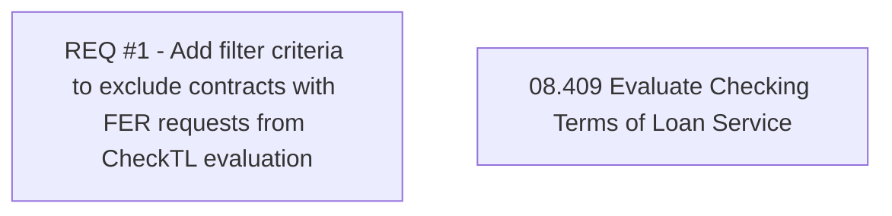

# CBL-3922 (CLM-1502) [Cash Loan] Hold Invoice Penalty Charging related FER request

- **Diagram Type**: Custom
- **Package**: HomerSelect/BSL/Requirements Model/Finished/CLM/CBL-3922 (CLM-1502) [Cash Loan] Hold Invoice Penalty Charging related FER request
- **Diagram ID**: 121117
- **Elements**: 2
- **Connectors**: 0

