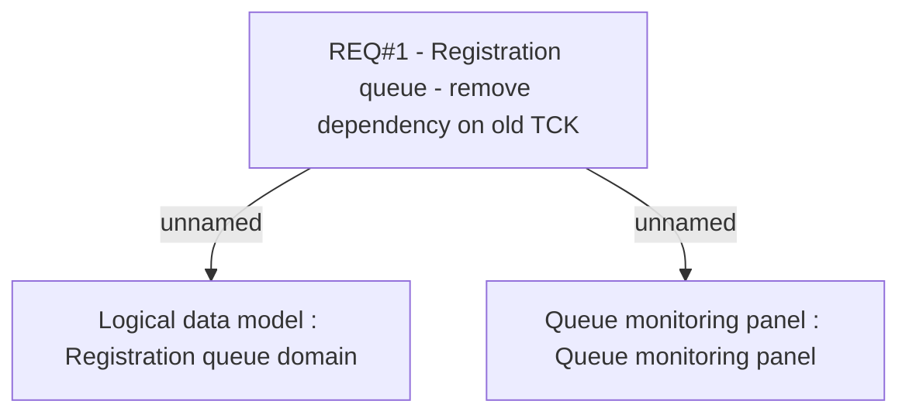

# CBL-3935 (CLM-1600) Registration queue - remove dependency on old TCK

```mermaid
graph TD
    Queue_monitoring_panel_Queue_monitoring_panel["Queue monitoring panel : Queue monitoring panel"]
    Logical_data_model_Registration_queue_domain["Logical data model : Registration queue domain"]
    REQ_1_Registration_queue_remove_dependency_on_old_TCK["REQ#1 - Registration queue - remove dependency on old TCK"]
    REQ_1_Registration_queue_remove_dependency_on_old_TCK -->|unnamed| Logical_data_model_Registration_queue_domain
    REQ_1_Registration_queue_remove_dependency_on_old_TCK -->|unnamed| Queue_monitoring_panel_Queue_monitoring_panel
```
