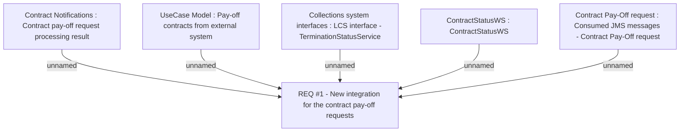

# CBL-395 (CLM-324) WS to JMS (async communication)

- **Diagram Type**: Custom
- **Package**: HomerSelect/BSL/Requirements Model/Finished/CLM/CBL-395 (CLM-324) WS to JMS (async communication)
- **Diagram ID**: 111097
- **Elements**: 6
- **Connectors**: 5

