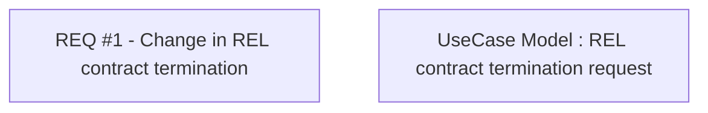

# CBL-3997 (CLM-1509) Change in calling REL contract termination

- **Diagram Type**: Custom
- **Package**: HomerSelect/BSL/Requirements Model/Finished/CLM/CBL-3997 (CLM-1509) Change in calling REL contract termination
- **Diagram ID**: 105887
- **Elements**: 2
- **Connectors**: 0

