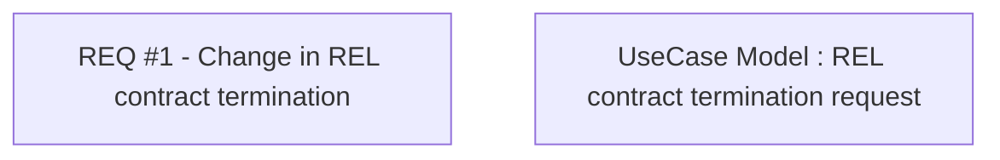

# CBL-3997 (CLM-1509) Change in calling REL contract termination

```mermaid
graph TD
    REQ_1_Change_in_REL_contract_termination["REQ #1 - Change in REL contract termination"]
    UseCase_Model_REL_contract_termination_request["UseCase Model : REL contract termination request"]
```
