# CBL-4047 (CLM-1820) Create API for PaymentHoliday

- **Diagram Type**: Custom
- **Package**: HomerSelect/BSL/Requirements Model/Finished/CLM/CBL-4047 (CLM-1820) Create API for PaymentHoliday
- **Diagram ID**: 121324
- **Elements**: 14
- **Connectors**: 7

```mermaid
graph TD
    Contract_PAYHOL_Service_Requests_Contract_PAYHOL_Service_Req["Contract PAYHOL Service Requests : Contract PAYHOL Service Requests - get preview"]
    Contract_PAYHOL_Service_Requests_Contract_PAYHOL_Service_Req["Contract PAYHOL Service Requests : Contract PAYHOL Service Requests - create request"]
    REQ_2_new_REST_API_for_Payment_holiday_preview_and_request["REQ#2 - new REST API for Payment holiday preview and request"]
    REQ_1_Extract_common_part_of_existing_Payment_holiday_functi["REQ#1 - Extract common part of existing Payment holiday functionalities to allow shared usage from GUI and API"]
    Check_ContractPayholRequest_input_parameters["Check ContractPayholRequest input parameters"]
    n_01_797_Create_ContractPayholRequest_service["01.797 Create ContractPayholRequest service"]
    n_01_796_Get_ContractPayholRequest_preview_service["01.796 Get ContractPayholRequest preview service"]
    n_01_796_Get_ContractPayholRequest_preview_service["01.796 Get ContractPayholRequest preview service"]
    n_01_797_Create_ContractPayholRequest_service["01.797 Create ContractPayholRequest service"]
    Use_Case_Model_Payment_holiday_request_creation_externally["Use Case Model : Payment holiday request creation - externally"]
    Use_Case_Model_Payment_holiday_request_creation_via_GUI["Use Case Model : Payment holiday request creation - via GUI"]
    n_08_355_Create_request_for_payment_holiday["08.355 Create request for payment holiday"]
    MOD_08_358_Create_request_for_payment_holiday_common["{MOD}08.358 Create request for payment holiday common"]
    n_08_358_Create_request_for_payment_holiday_common["08.358 Create request for payment holiday common"]
    n_01_797_Create_ContractPayholRequest_service -->|unnamed| MOD_08_358_Create_request_for_payment_holiday_common
    n_08_355_Create_request_for_payment_holiday -->|unnamed| MOD_08_358_Create_request_for_payment_holiday_common
    MOD_08_358_Create_request_for_payment_holiday_common -->|unnamed| n_08_358_Create_request_for_payment_holiday_common
    n_01_797_Create_ContractPayholRequest_service -->|unnamed| Check_ContractPayholRequest_input_parameters
    n_01_797_Create_ContractPayholRequest_service -->|unnamed| n_01_797_Create_ContractPayholRequest_service
    n_01_796_Get_ContractPayholRequest_preview_service -->|unnamed| Check_ContractPayholRequest_input_parameters
    n_01_796_Get_ContractPayholRequest_preview_service -->|unnamed| n_01_796_Get_ContractPayholRequest_preview_service
```

