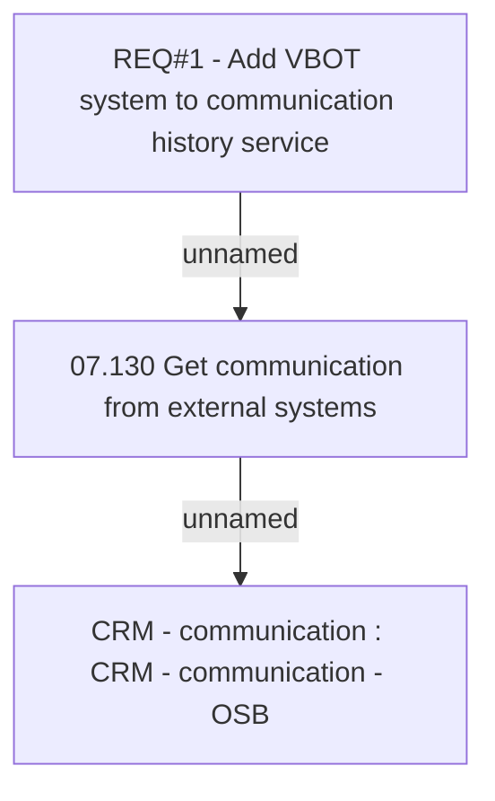

# CBL-4052 (CLM-1531) Add VBOT system to communication history service

```mermaid
graph TD
    n_07_130_Get_communication_from_external_systems["07.130 Get communication from external systems"]
    CRM_communication_CRM_communication_OSB["CRM - communication : CRM - communication - OSB"]
    REQ_1_Add_VBOT_system_to_communication_history_service["REQ#1 - Add VBOT system to communication history service"]
    REQ_1_Add_VBOT_system_to_communication_history_service -->|unnamed| n_07_130_Get_communication_from_external_systems
    n_07_130_Get_communication_from_external_systems -->|unnamed| CRM_communication_CRM_communication_OSB
```
