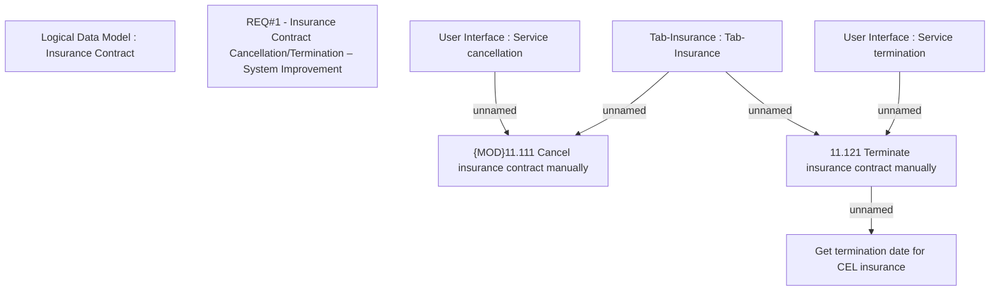

# CBL-4059 (CLM-1585) Insurance Contract Cancellation/Termination – System Improvement

- **Diagram Type**: Custom
- **Package**: HomerSelect/BSL/Requirements Model/Finished/CLM/CBL-4059 (CLM-1585) Insurance Contract Cancellation/Termination – System Improvement
- **Diagram ID**: 111190
- **Elements**: 8
- **Connectors**: 5

