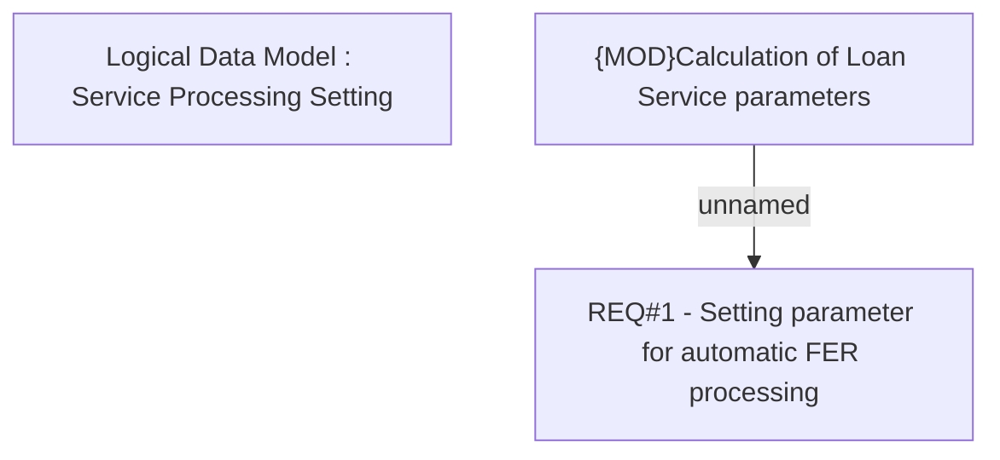

# CBL-4071 (CLM-1708) Full Early Repayment Services Automation

- **Diagram Type**: Custom
- **Package**: HomerSelect/BSL/Requirements Model/Finished/CLM/CBL-4071 (CLM-1708) Full Early Repayment Services Automation
- **Diagram ID**: 115448
- **Elements**: 3
- **Connectors**: 1

