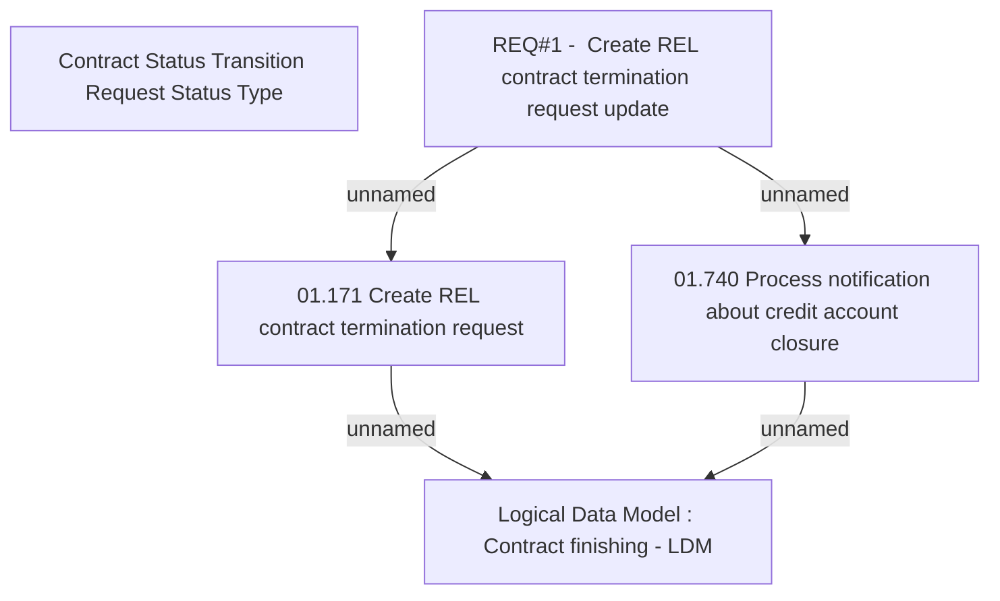

# CBL-4150 (CLM-1542) Create REL contract termination request update

- **Diagram Type**: Custom
- **Package**: HomerSelect/BSL/Requirements Model/Finished/CLM/CBL-4150 (CLM-1542) Create REL contract termination request update
- **Diagram ID**: 108474
- **Elements**: 5
- **Connectors**: 4

