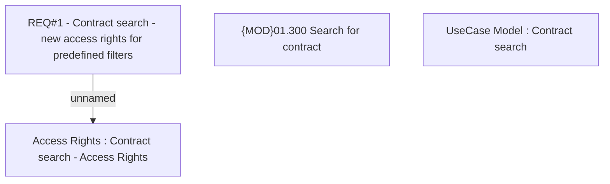

# CBL-4153 (CLM-1594) Contract search - new access rights for predefined filters

```mermaid
graph TD
    REQ_1_Contract_search_new_access_rights_for_predefined_filte["REQ#1 - Contract search - new access rights for predefined filters"]
    Access_Rights_Contract_search_Access_Rights["Access Rights : Contract search - Access Rights"]
    MOD_01_300_Search_for_contract["{MOD}01.300 Search for contract"]
    UseCase_Model_Contract_search["UseCase Model : Contract search"]
    REQ_1_Contract_search_new_access_rights_for_predefined_filte -->|unnamed| Access_Rights_Contract_search_Access_Rights
```
