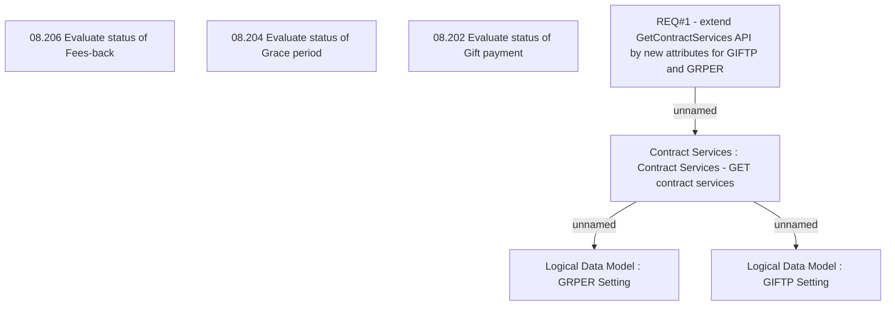

# CBL-4154 (CLM-1615) Extend GetContractServices WS for GIFTP and GRPER

- **Diagram Type**: Custom
- **Package**: HomerSelect/BSL/Requirements Model/Finished/CLM/CBL-4154 (CLM-1615) Extend GetContractServices WS for GIFTP and GRPER
- **Diagram ID**: 111191
- **Elements**: 7
- **Connectors**: 3

