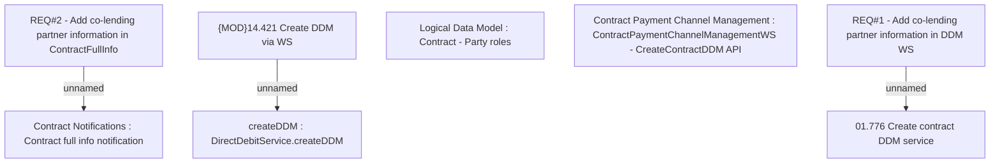

# CBL-4161 (CLM-1598)  Add co-lending partner information in ContractFullInfo and DDM WS

- **Diagram Type**: Custom
- **Package**: HomerSelect/BSL/Requirements Model/Finished/CLM/CBL-4161 (CLM-1598)  Add co-lending partner information in ContractFullInfo and DDM WS
- **Diagram ID**: 109436
- **Elements**: 8
- **Connectors**: 3

