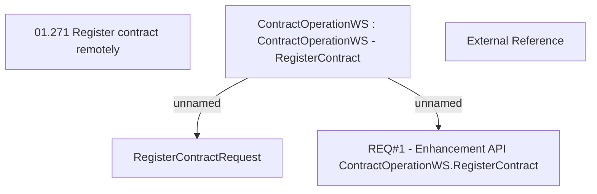

# CBL-4167 (CLM-1613) Enhancement API ContractOperationsService

```mermaid
graph TD
    n_01_271_Register_contract_remotely["01.271 Register contract remotely"]
    RegisterContractRequest["RegisterContractRequest"]
    ContractOperationWS_ContractOperationWS_RegisterContract["ContractOperationWS : ContractOperationWS - RegisterContract"]
    REQ_1_Enhancement_API_ContractOperationWS_RegisterContract["REQ#1 - Enhancement API ContractOperationWS.RegisterContract"]
    External_Reference["External Reference"]
    ContractOperationWS_ContractOperationWS_RegisterContract -->|unnamed| RegisterContractRequest
    ContractOperationWS_ContractOperationWS_RegisterContract -->|unnamed| REQ_1_Enhancement_API_ContractOperationWS_RegisterContract
```
