# CBL-4285 (CLM-1706) Payment made before due date

- **Diagram Type**: Custom
- **Package**: HomerSelect/BSL/Requirements Model/Finished/CLM/CBL-4285 (CLM-1706) Payment made before due date
- **Diagram ID**: 113072
- **Elements**: 11
- **Connectors**: 10

```mermaid
graph TD
    Partial_early_repayment_preview_Partial_early_repayment_prev["Partial early repayment preview : Partial early repayment preview"]
    Use_Case_Contract_Early_Termination_request_creation["Use Case : Contract Early Termination request creation"]
    REQ_3_COP_request_functionality_modification["REQ #3 - COP request functionality modification"]
    REQ_2_CET_request_functionality_modification["REQ #2 - CET request functionality modification"]
    Use_Case_Model_Cooling_off_period_request["Use Case Model : Cooling-off period request"]
    ER_request_preview_Early_repayment_preview["ER request preview : Early repayment preview"]
    Use_Case_Full_early_repayment_request_via_GUI["Use Case : Full early repayment request - via GUI"]
    HO_SERVICE_REQUEST_DATA_HO_SERVICE_REQUEST_DATA_FER_printout["HO_SERVICE_REQUEST_DATA : HO_SERVICE_REQUEST_DATA - FER printout usage"]
    HO_ER_REQUEST_DATA_HO_ER_REQUEST_DATA["HO_ER_REQUEST_DATA : HO_ER_REQUEST_DATA"]
    REQ_4_PER_request_functionality_modification["REQ #4 - PER request functionality modification"]
    REQ_1_FER_request_functionality_modification["REQ #1 - FER request functionality modification"]
    ER_request_preview_Early_repayment_preview -->|unnamed| REQ_1_FER_request_functionality_modification
    Use_Case_Full_early_repayment_request_via_GUI -->|unnamed| REQ_1_FER_request_functionality_modification
    HO_SERVICE_REQUEST_DATA_HO_SERVICE_REQUEST_DATA_FER_printout -->|unnamed| REQ_1_FER_request_functionality_modification
    Partial_early_repayment_preview_Partial_early_repayment_prev -->|unnamed| REQ_4_PER_request_functionality_modification
    HO_ER_REQUEST_DATA_HO_ER_REQUEST_DATA -->|unnamed| REQ_4_PER_request_functionality_modification
    Use_Case_Contract_Early_Termination_request_creation -->|unnamed| REQ_2_CET_request_functionality_modification
    ER_request_preview_Early_repayment_preview -->|unnamed| REQ_2_CET_request_functionality_modification
    HO_ER_REQUEST_DATA_HO_ER_REQUEST_DATA -->|unnamed| REQ_2_CET_request_functionality_modification
    Use_Case_Model_Cooling_off_period_request -->|unnamed| REQ_3_COP_request_functionality_modification
    HO_ER_REQUEST_DATA_HO_ER_REQUEST_DATA -->|unnamed| REQ_3_COP_request_functionality_modification
```

