# CBL-4294 (CLM-1601) Securitization: Split of ownership of contract

- **Diagram Type**: Custom
- **Package**: HomerSelect/BSL/Requirements Model/Finished/CLM/CBL-4294 (CLM-1601) Securitization: Split of ownership of contract
- **Diagram ID**: 109453
- **Elements**: 13
- **Connectors**: 8

```mermaid
graph TD
    REQ_5_extension_of_ContractFullInfo_for_more_owners["REQ#5 - extension of ContractFullInfo for more owners"]
    Contract_Notifications_Contract_full_info_notification["Contract Notifications : Contract full info notification"]
    REQ_4_extension_of_the_ContractSecuritizationNotification_me["REQ#4 - extension of the ContractSecuritizationNotification message for more owners"]
    REQ_3_update_of_the_securitization_process["REQ#3 - update of the securitization process"]
    Logical_Data_Model_Contract_ownership["Logical Data Model : Contract ownership"]
    REQ_2_extension_of_the_Securitization_Tranche_and_Ownership_["REQ#2 - extension of the Securitization Tranche and Ownership domain for more owners"]
    REQ_1_Extension_of_the_securitization_file_for_more_owners["REQ#1 - Extension of the securitization file for more owners"]
    Interface_model_Contract_securitization_file_structure["Interface model : Contract securitization - file structure "]
    Logical_Data_model_Contract_securitization_LDM["Logical Data model : Contract securitization - LDM"]
    n_01_863_Perform_contract_securitization["01.863 Perform contract securitization"]
    n_01_860_Process_contract_securitization_file["01.860 Process contract securitization file"]
    n_01_864_Generate_notifications_about_contract_securitizatio["01.864 Generate notifications about contract securitization"]
    Contract_Securitization_Generated_JMS_messages_Contract_Secu["Contract Securitization : Generated JMS messages - Contract Securitization"]
    REQ_5_extension_of_ContractFullInfo_for_more_owners -->|unnamed| Contract_Notifications_Contract_full_info_notification
    REQ_4_extension_of_the_ContractSecuritizationNotification_me -->|unnamed| Contract_Securitization_Generated_JMS_messages_Contract_Secu
    REQ_4_extension_of_the_ContractSecuritizationNotification_me -->|unnamed| n_01_864_Generate_notifications_about_contract_securitizatio
    REQ_3_update_of_the_securitization_process -->|unnamed| n_01_860_Process_contract_securitization_file
    REQ_3_update_of_the_securitization_process -->|unnamed| n_01_863_Perform_contract_securitization
    REQ_2_extension_of_the_Securitization_Tranche_and_Ownership_ -->|unnamed| Logical_Data_model_Contract_securitization_LDM
    REQ_1_Extension_of_the_securitization_file_for_more_owners -->|unnamed| Interface_model_Contract_securitization_file_structure
    REQ_2_extension_of_the_Securitization_Tranche_and_Ownership_ -->|unnamed| Logical_Data_Model_Contract_ownership
```

