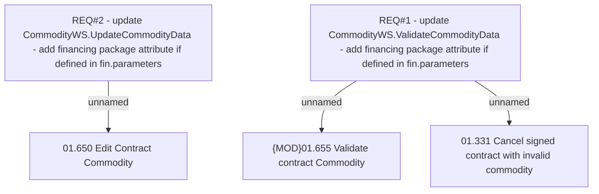

# CBL-4312 (CLM-1709) Commodity Validation extension for Financing Schemes

```mermaid
graph TD
    n_01_331_Cancel_signed_contract_with_invalid_commodity["01.331 Cancel signed contract with invalid commodity"]
    n_01_650_Edit_Contract_Commodity["01.650 Edit Contract Commodity"]
    MOD_01_655_Validate_contract_Commodity["{MOD}01.655 Validate contract Commodity"]
    REQ_2_update_CommodityWS_UpdateCommodityData_add_financing_p["REQ#2 - update CommodityWS.UpdateCommodityData - add financing package attribute if defined in fin.parameters"]
    REQ_1_update_CommodityWS_ValidateCommodityData_add_financing["REQ#1 - update CommodityWS.ValidateCommodityData - add financing package attribute if defined in fin.parameters"]
    REQ_2_update_CommodityWS_UpdateCommodityData_add_financing_p -->|unnamed| n_01_650_Edit_Contract_Commodity
    REQ_1_update_CommodityWS_ValidateCommodityData_add_financing -->|unnamed| MOD_01_655_Validate_contract_Commodity
    REQ_1_update_CommodityWS_ValidateCommodityData_add_financing -->|unnamed| n_01_331_Cancel_signed_contract_with_invalid_commodity
```
