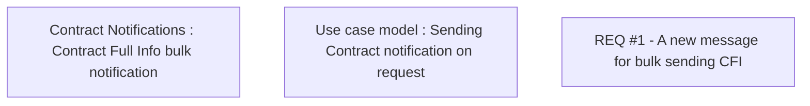

# CBL-4392 (CLM-1612) Optimizing function for ContractFullInfo notification on external request

- **Diagram Type**: Custom
- **Package**: HomerSelect/BSL/Requirements Model/Finished/CLM/CBL-4392 (CLM-1612) Optimizing function for ContractFullInfo notification on external request
- **Diagram ID**: 145038
- **Elements**: 3
- **Connectors**: 0

