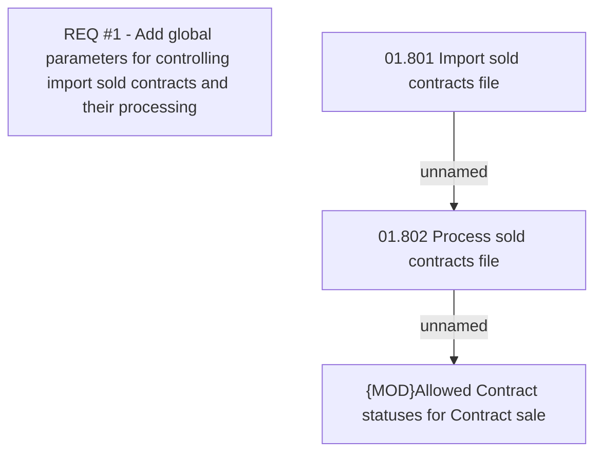

# CBL-4472 (CLM-1687) PH Contract Debt Sale

- **Diagram Type**: Custom
- **Package**: HomerSelect/BSL/Requirements Model/Finished/CLM/CBL-4472 (CLM-1687) PH Contract Debt Sale
- **Diagram ID**: 144810
- **Elements**: 4
- **Connectors**: 2

