# CBL-4480 (CLM-1770) Web Service to Add Insurance in Mobile Application

- **Diagram Type**: Custom
- **Package**: HomerSelect/BSL/Requirements Model/Finished/CLM/CBL-4480 (CLM-1770) Web Service to Add Insurance in Mobile Application
- **Diagram ID**: 113232
- **Elements**: 12
- **Connectors**: 7

```mermaid
graph TD
    Insurance_Contract_Services_Insurance_Contract_Change_Insura["Insurance Contract Services : Insurance Contract - Change Insurance operation status"]
    Use_Case_Model_Changing_insurance_operation_status["Use Case Model : Changing insurance operation status"]
    REQ_3_Changing_insurance_operation_status["REQ #3 - Changing insurance operation status"]
    Use_Case_Model_Adding_Insurance_Service_on_REL_contract["Use Case Model : Adding Insurance Service on REL contract"]
    Use_Case_Model_Insurance_Service_Offers_Use_Case_Model["Use Case Model :Insurance Service Offers - Use Case Model"]
    Contract_Insurance_Services_Contract_Insurance_Services_GET_["Contract Insurance Services :Contract Insurance Services - GET: Contract list Insurances"]
    Contract_Insurance_Services_Contract_Insurance_Services_POST["Contract Insurance Services : Contract Insurance Services - POST: Contract Insurance Service"]
    Insurance_Services_Insurance_Services_GET_Insurance_Service_["Insurance Services : Insurance Services - GET: Insurance Service Offer"]
    el_1367335["Note"]
    REQ_4_Getting_list_of_insurances_originated_to_the_REL_contr["REQ #4 - Getting list of insurances originated to the REL contract and Insurance Contract detail"]
    REQ_2_Adding_insurance_on_REL_contract["REQ #2 - Adding insurance on REL contract"]
    REQ_1_Getting_list_of_available_insurance_offers_for_REL_con["REQ #1 - Getting list of available insurance offers for REL contract "]
    Use_Case_Model_Insurance_Service_Offers_Use_Case_Model -->|unnamed| REQ_1_Getting_list_of_available_insurance_offers_for_REL_con
    Insurance_Services_Insurance_Services_GET_Insurance_Service_ -->|unnamed| REQ_1_Getting_list_of_available_insurance_offers_for_REL_con
    Use_Case_Model_Adding_Insurance_Service_on_REL_contract -->|unnamed| REQ_2_Adding_insurance_on_REL_contract
    Contract_Insurance_Services_Contract_Insurance_Services_POST -->|unnamed| REQ_2_Adding_insurance_on_REL_contract
    Contract_Insurance_Services_Contract_Insurance_Services_GET_ -->|unnamed| REQ_4_Getting_list_of_insurances_originated_to_the_REL_contr
    Insurance_Contract_Services_Insurance_Contract_Change_Insura -->|unnamed| REQ_3_Changing_insurance_operation_status
    Use_Case_Model_Changing_insurance_operation_status -->|unnamed| REQ_3_Changing_insurance_operation_status
```

