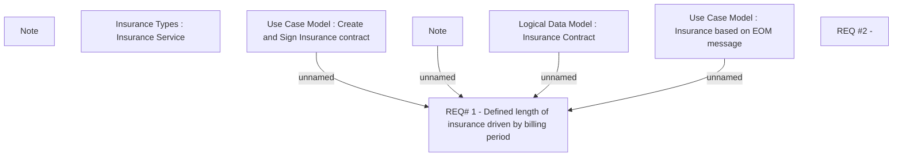

# CBL-4522 (CLM-1722) New features for Insurance Service setting

```mermaid
graph TD
    el_1425758["Note"]
    Insurance_Types_Insurance_Service["Insurance Types : Insurance Service"]
    Use_Case_Model_Create_and_Sign_Insurance_contract["Use Case Model : Create and Sign Insurance contract"]
    el_1425757["Note"]
    Logical_Data_Model_Insurance_Contract["Logical Data Model : Insurance Contract"]
    Use_Case_Model_Insurance_based_on_EOM_message["Use Case Model : Insurance based on EOM message"]
    REQ_2["REQ #2 - "]
    REQ_1_Defined_length_of_insurance_driven_by_billing_period["REQ# 1 - Defined length of insurance driven by billing period"]
    Use_Case_Model_Create_and_Sign_Insurance_contract -->|unnamed| REQ_1_Defined_length_of_insurance_driven_by_billing_period
    el_1425757 -->|unnamed| REQ_1_Defined_length_of_insurance_driven_by_billing_period
    Logical_Data_Model_Insurance_Contract -->|unnamed| REQ_1_Defined_length_of_insurance_driven_by_billing_period
    Use_Case_Model_Insurance_based_on_EOM_message -->|unnamed| REQ_1_Defined_length_of_insurance_driven_by_billing_period
```
