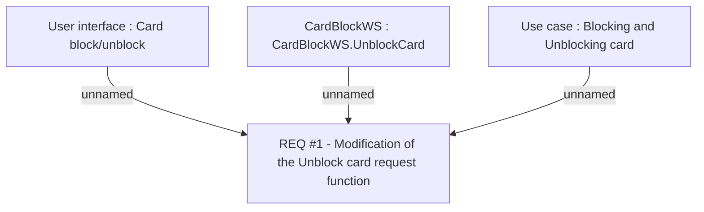

# CBL-4612 (CLM-1693) Add new Note field for Unblock credit card

```mermaid
graph TD
    User_interface_Card_block_unblock["User interface : Card block/unblock"]
    CardBlockWS_CardBlockWS_UnblockCard["CardBlockWS : CardBlockWS.UnblockCard"]
    Use_case_Blocking_Unblocking_card["Use case : Blocking and Unblocking card"]
    REQ_1_Modification_of_the_Unblock_card_request_function["REQ #1 - Modification of the Unblock card request function"]
    User_interface_Card_block_unblock -->|unnamed| REQ_1_Modification_of_the_Unblock_card_request_function
    CardBlockWS_CardBlockWS_UnblockCard -->|unnamed| REQ_1_Modification_of_the_Unblock_card_request_function
    Use_case_Blocking_Unblocking_card -->|unnamed| REQ_1_Modification_of_the_Unblock_card_request_function
```
