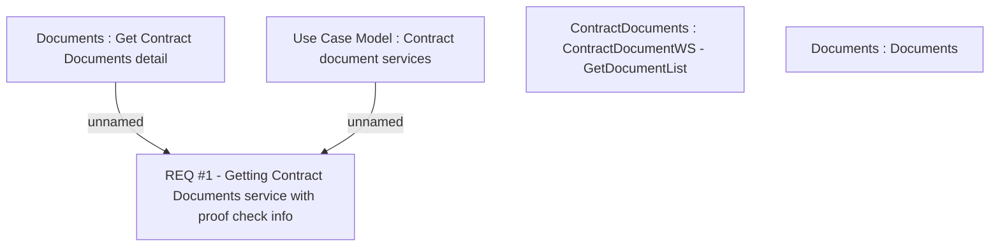

# CBL-4643 (CLM-1727) ContractDocument service extension with ProofCheck information

- **Diagram Type**: Custom
- **Package**: HomerSelect/BSL/Requirements Model/Finished/CLM/CBL-4643 (CLM-1727) ContractDocument service extension with ProofCheck information
- **Diagram ID**: 110953
- **Elements**: 5
- **Connectors**: 2

