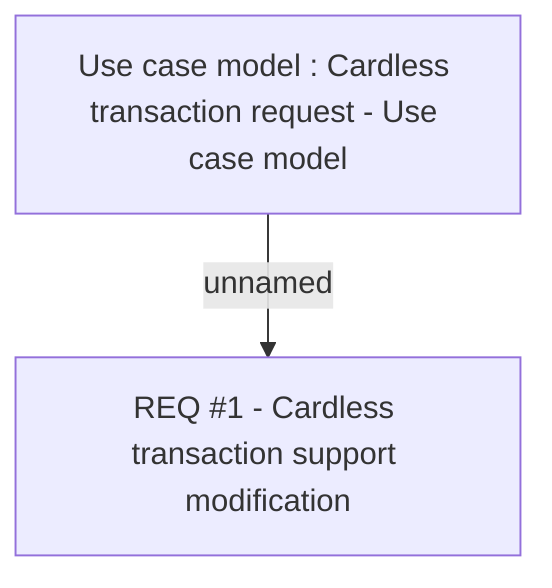

# CBL-4685 (CLM-1954) Transaction Id support in Cardless transactions

```mermaid
graph TD
    Use_case_model_Cardless_transaction_request_Use_case_model["Use case model : Cardless transaction request - Use case model"]
    REQ_1_Cardless_transaction_support_modification["REQ #1 - Cardless transaction support modification"]
    Use_case_model_Cardless_transaction_request_Use_case_model -->|unnamed| REQ_1_Cardless_transaction_support_modification
```
