# CBL-4708 (CLM-2911) Scan Based Mandate Support in HOSEL

- **Diagram Type**: Custom
- **Package**: HomerSelect/BSL/Requirements Model/Finished/CLM/CBL-4708 (CLM-2911) Scan Based Mandate Support in HOSEL
- **Diagram ID**: 127114
- **Elements**: 25
- **Connectors**: 5

```mermaid
graph TD
    External_Reference["External Reference"]
    RegisterContractFaultType["RegisterContractFaultType"]
    n_01_125_Upload_contract_document["01.125 Upload contract document"]
    n_01_112_Edit_DDM_document["01.112 Edit DDM document"]
    REQ_3_Implement_condition_for_receiving_DDM["REQ #3 - Implement condition for receiving DDM"]
    REQ_2_Implement_DDM_document_attributes_validation_before_re["REQ #2 - Implement DDM document attributes validation before registration"]
    BIZ_1_Automate_DDM_processing["BIZ #1 - Automate DDM processing "]
    Check_all["Check all"]
    Check["Check"]
    User_Interface_Model_Document_registration_form["User Interface Model : Document registration form"]
    ADD_Edit_DDM_document["{ADD}Edit DDM document"]
    ADD_Upload_DDM_document["{ADD}Upload DDM document"]
    MOD_Generate_documents_list_for_contract_registration["{MOD}Generate documents list for contract registration"]
    n_01_275_Show_registration_tab["01.275 Show registration tab"]
    UseCase_Model_Contract_registration["UseCase Model : Contract registration"]
    User_Interface_Model_Document_registration_form["User Interface Model : Document registration form"]
    n_01_271_Register_contract_remotely["01.271 Register contract remotely"]
    MOD_Validate_documents_before_registration["{MOD}Validate documents before registration"]
    n_01_270_Register_contract_manually["01.270 Register contract manually"]
    Register_contract["Register contract"]
    REQ_1_Implement_DDM_document_editing_and_uploading_from_Regi["REQ #1 - Implement DDM document editing and uploading from Registration tab"]
    Edit_DDM_document_or_Edit_DDM_document_from_Registration_tab["Edit DDM  document or Edit DDM document from Registration tab"]
    Validate_DDM_document_attributes_before_registration["Validate DDM document attributes before registration"]
    Condition_for_receiving_DDM["Condition for receiving DDM"]
    ContractOperationsWS_RegisterContractResponse_resultCode["ContractOperationsWS.RegisterContractResponse.resultCode"]
    ADD_Upload_DDM_document -->|unnamed| n_01_125_Upload_contract_document
    ADD_Upload_DDM_document -->|unnamed| n_01_275_Show_registration_tab
    ADD_Edit_DDM_document -->|unnamed| n_01_275_Show_registration_tab
    ADD_Edit_DDM_document -->|unnamed| n_01_112_Edit_DDM_document
    n_01_275_Show_registration_tab -->|unnamed| MOD_Generate_documents_list_for_contract_registration
```

